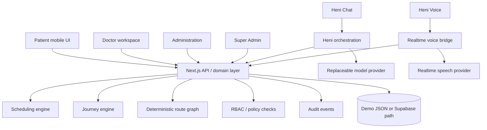

# Hani Maak - هاني معاك

> **Access -> Guidance -> Continuity** for the patient journey around a healthcare appointment.

Hani Maak is a multilingual, white-label patient-journey platform designed for healthcare providers. It helps patients discover services, book and manage appointments, prepare correctly, navigate the facility, understand the next administrative step, and stay connected after the visit - through both a mobile experience and Heni, the conversational assistant.

**Live competition build:** https://hani-maak.vercel.app/

> Competition prototype for the Future Health Connectathon 2026. Demo patients and clinical examples are synthetic. The Charles Nicolle geographic context is real; prototype indoor routing is not presented as an authoritative hospital floor plan.

## Why Hani Maak

Most appointment systems stop after scheduling. Patients still need to know where to go, what to bring, what happens next, and who to contact when they are confused. Healthcare staff repeatedly answer the same administrative questions while still needing strict boundaries around clinical responsibility and sensitive data.

Hani Maak connects the steps around the appointment without making the AI the source of truth.

## Product at a glance

| Area | What the prototype demonstrates |
| --- | --- |
| Patient | Service discovery, booking, appointment management, journey steps, multilingual UI, hospital map, recorded AR guidance |
| Heni Chat | Floating assistant with Tunisian Derja / French / English support, deterministic actions, safety boundaries, model-provider abstraction |
| Heni Voice | Browser voice fallback plus an optional realtime/PSTN bridge with constrained administrative tools |
| Doctor | Clinical patient workspace and clinical-note access through explicit permissions |
| Administration | Appointments, services, schedules and patient operations without full clinical access |
| Super Admin | Roles, accounts, audit visibility, maps, white-label and platform configuration |
| Platform | Audited domain actions, deterministic scheduling and routing, optional Supabase persistence, synthetic demo reset |

## Heni AI

Heni is a **first-class product module**, not a generic chatbot added on top of the UI.

Heni's default spoken style is natural Tunisian Derja. French code-switching is expected and English is supported. The assistant follows the user's language when they switch during a conversation.

The architecture is intentionally provider-aware but not provider-locked:

- `development` mode keeps the tested deterministic competition behavior available without paid AI services;
- a server-side model provider can be enabled for conversational turns;
- `HENI_FINE_TUNED_MODEL_ID` can select a validated future fine-tuned model without changing the patient UI;
- action truth remains in deterministic application tools, not in model memory;
- realtime speech is isolated in the voice bridge so the speech provider can evolve independently.

### Heni safety boundary

Heni may automate administrative tasks and surface provider-authored information. It does **not** diagnose, prescribe, change medication doses, determine clinical urgency, or certify medication safety. Clinical-boundary requests are redirected to human support.

State-changing actions require explicit confirmation, and the application backend remains the authority for availability, appointments, permissions, routing and journey state.

### Patient-aware Heni runtime

Every Heni text turn and live voice session now refreshes a trusted runtime context from the Hani Maak backend before the model responds. That context contains only the current authorized patient's non-clinical profile, their own appointments/journey state, plus verified public hospital information. Mutable facts are not memorized in the prompt or fine-tuning dataset.

Heni can list the patient's appointments, distinguish "I already have a rendez-vous" from "I want to book one", check availability, book/reschedule/cancel with code-enforced confirmation, retrieve approved instructions, provide platform navigation context and create a human escalation. If the external model or tool transport is temporarily unavailable, the website falls back to the deterministic Heni flow instead of breaking the patient conversation.

## Architecture

**Core principle: deterministic core, probabilistic interface.**



AI interprets language and can request approved actions. It does not own the underlying healthcare workflow state.

## User roles and access model

- **Patient** - sees their journey, appointments, guidance and approved instructions.
- **Doctor** - receives the medical access required by the doctor workspace, including clinical information and notes.
- **Administration** - manages scheduling and operational data without full clinical access.
- **Super Admin** - manages platform configuration, accounts, roles, AI settings, maps, integrations and white-label behavior; clinical access is not granted by default merely because the user is a platform administrator.

Authorization is enforced at server/API boundaries for protected staff operations, not only by hiding menu items.

## Technology stack

- **Frontend / application:** Next.js 16.3.5 App Router, React 19.2, TypeScript 5.9
- **Runtime:** Node.js 22.6+
- **Persistence:** local JSON demo repository or optional Supabase/Postgres path
- **Voice bridge:** Fastify 5, WebSockets, optional Twilio media streaming and realtime AI provider
- **Deployment:** Vercel for the web application
- **Testing:** Node test runner plus deterministic Heni/voice evaluation scenarios
- **Maps / guidance:** deterministic facility graph plus web map context and recorded AR-style walkthrough

## Repository structure

```text
hani-maak/
├── apps/
│   ├── web/                 # Patient app, staff consoles, APIs, Heni Chat and browser Voice Lab
│   └── voice-bridge/        # Optional realtime / PSTN speech bridge
├── ai/                      # Fine-tuning and model-governance documentation; synthetic examples only
├── docs/                    # Architecture, security, setup, testing and competition documentation
├── evals/                   # Deterministic Heni intent/safety evaluation set and results
├── scripts/                 # Demo reset and evaluation scripts
├── supabase/                # Production-oriented schema and competition persistence path
├── tests/                   # Domain, RBAC and Heni safety tests
├── .github/                 # CI, issue forms, PR template and repository governance
└── README.md
```

The repository remains a small monorepo because the product currently has two real deployable applications. We deliberately avoid creating empty microservices or architecture layers purely for appearance.

## Getting started

### Prerequisites

- Node.js 22.6+
- npm 10+

```bash
git clone https://github.com/Ahmed-Braiek/hani-maak.git
cd hani-maak
cp .env.example .env.local
npm install
npm run demo:reset
npm run dev
```

Open `http://localhost:3000`.

### Useful routes

- `/patient` - patient journey home
- `/patient/services` - service discovery and booking
- `/patient/journey` - appointment-to-follow-up journey
- `/patient/map` - hospital map, localization and AR entry point
- `/patient/map/ar?demo=nuclear-medicine` - recorded nuclear-medicine walkthrough
- `/voice-lab` - browser Heni voice fallback
- `/staff` - authenticated role-oriented staff console (redirects to `/staff-login` when signed out)
- `/staff-login` - role-aware staff sign-in with public competition demo accounts
- `/staff-signup` - staff access request flow; requests remain pending until approval
- `/present` - competition presentation mode


### Competition staff accounts

The public competition build includes three intentionally public demo accounts so reviewers can verify authentication and role separation end to end. These credentials are **not production secrets** and must never be reused for a hospital deployment.

| Role | Username | Password |
| --- | --- | --- |
| Doctor | `doctor.demo` | `HaniDoctor2026!` |
| Administration | `admin.demo` | `HaniAdmin2026!` |
| Super Admin | `super.demo` | `HaniSuper2026!` |

Open `/staff` while signed out to be redirected to the sign-in screen. Role changes inside the authenticated console remain available only in competition demo mode. Account requests created from `/staff-signup` stay pending and do not receive permissions automatically.

## Environment configuration

`.env.example` documents the supported environment variables. Secrets are server-side only and must never be committed.

For the zero-setup competition path, keep:

```text
DEMO_MODE=true
HANI_DATA_BACKEND=file
HENI_AI_PROVIDER=development
```

For shared competition persistence, use Supabase with the documented server-side secret. For model-backed Heni Chat, configure `HENI_AI_PROVIDER`, `HENI_CHAT_MODEL` or a validated `HENI_FINE_TUNED_MODEL_ID`, and a server-side provider key.

See [`docs/setup/LOCAL_DEVELOPMENT.md`](docs/setup/LOCAL_DEVELOPMENT.md) and [`docs/ai/HENI.md`](docs/ai/HENI.md).

## Testing and verification

```bash
npm test
npm run evals
npm run typecheck
npm run voice:check
npm run build
```

Or run the complete repository verification sequence:

```bash
npm run verify
```

The deterministic evaluation dataset is a prototype engineering check, not a claim of clinical accuracy or live speech-recognition accuracy.

## Security and privacy

Security is part of the product architecture because Hani Maak may eventually process sensitive healthcare information.

Current principles include:

- signed HttpOnly staff sessions in front of the staff console;
- demo sign-in credentials that are intentionally public for competition review, never treated as production secrets;
- self-signup requests that never grant a privileged role automatically;
- least-privilege role/permission design;
- separate administrative and clinical access;
- server-side secret handling;
- explicit confirmation for voice-driven mutations;
- audit events for important actions;
- deterministic tool ownership of appointment and route truth;
- no public repository of private medical training data;
- human escalation at the clinical boundary;
- no unnecessary sensitive information in logs or GitHub issues.

The competition build uses synthetic patient data. It is **not represented as HIPAA, GDPR, ISO 27001, or other certified/compliant production infrastructure**. Production authentication, provider agreements, data-retention policy, security monitoring, validated hospital data and formal compliance work remain deployment requirements.

Read [`SECURITY.md`](SECURITY.md) and [`docs/security/SECURITY_ARCHITECTURE.md`](docs/security/SECURITY_ARCHITECTURE.md).

## Documentation

Start with [`docs/README.md`](docs/README.md).

Key references:

- [`docs/architecture/OVERVIEW.md`](docs/architecture/OVERVIEW.md)
- [`docs/ai/HENI.md`](docs/ai/HENI.md)
- [`docs/roles-and-permissions/RBAC.md`](docs/roles-and-permissions/RBAC.md)
- [`docs/testing/TESTING_STRATEGY.md`](docs/testing/TESTING_STRATEGY.md)
- [`docs/KNOWN_LIMITATIONS.md`](docs/KNOWN_LIMITATIONS.md)
- [`docs/COMPETITION_RUNBOOK.md`](docs/COMPETITION_RUNBOOK.md)

## Roadmap

Near-term production work is intentionally concrete:

1. validate and connect the selected fine-tuned Heni model against the documented multilingual/safety evaluation suite;
2. complete production identity/authentication and database-enforced tenant/RBAC policies;
3. production-harden realtime speech, telephony verification, rate limiting and observability;
4. validate facility maps/routes with a healthcare-provider partner before clinical-site use;
5. integrate authorized HIS/EHR/FHIR systems only where a provider supplies governance and API access.

## Contributing, support and security reporting

- Contribution guide: [`CONTRIBUTING.md`](CONTRIBUTING.md)
- Support routes: [`SUPPORT.md`](SUPPORT.md)
- Security reporting: [`SECURITY.md`](SECURITY.md)
- Change history from this point forward: [`CHANGELOG.md`](CHANGELOG.md)

Do not include real patient information, credentials or security-sensitive details in public issues or pull requests.

## License status

This repository is not currently offered under an open-source license. See [`LICENSE.md`](LICENSE.md) for the current project notice. The project owners can replace it with an explicit license later if the legal/distribution model changes.

## Maintainer

Repository maintained through the `Ahmed-Braiek/hani-maak` project. Additional contribution attribution should follow the Git history rather than being invented manually.
