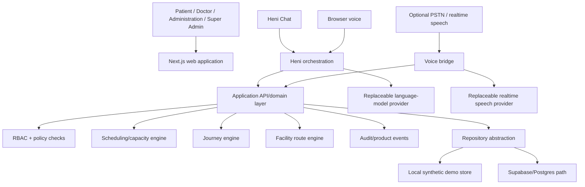

# Architecture Overview

## Architecture principle

Hani Maak uses a **deterministic core with a probabilistic interface**.

AI may understand natural language and decide which approved administrative capability the user is asking for. It does not own appointment truth, authorization, routes, provider-authored instructions or journey state.

## Deployable applications

### `apps/web`

Next.js App Router application containing patient/staff UI, versioned API routes, domain services, Heni Chat orchestration and the browser competition voice experience.

### `apps/voice-bridge`

Optional realtime/PSTN adapter. It is intentionally separate because long-lived audio streams and telephony provider requirements have different operational characteristics from the web UI.

## Data ownership

- **Scheduling engine** owns valid slots/capacity rules.
- **Journey/domain operations** own appointment and journey mutations.
- **RBAC/server guards** own protected staff authorization.
- **Route engine** owns facility path calculation.
- **Provider-authored content** owns preparation/follow-up instructions.
- **Heni** owns conversational interpretation and presentation, never the underlying truth.

## Persistence

The competition build can run from a local JSON repository with synthetic data. A Supabase/Postgres path exists for shared persistence. The local JSON path is deliberately not presented as production multi-instance storage.

## Failure isolation

- External AI unavailable -> deterministic patient/staff workflows remain usable.
- Heni model request fails -> deterministic Heni path remains available for supported actions.
- Voice provider unavailable -> typed/mobile flows continue.
- Map provider unavailable -> local/product navigation context can still be presented where implemented.
- Shared database unavailable in local demo -> competition JSON store remains available.

## Production evolution

Production use requires real identity/authentication, database-level tenant policies, transactional persistence, verified voice/webhook contracts, rate limiting, monitoring, provider-approved facility data and the legal/security controls appropriate to the deployment.
